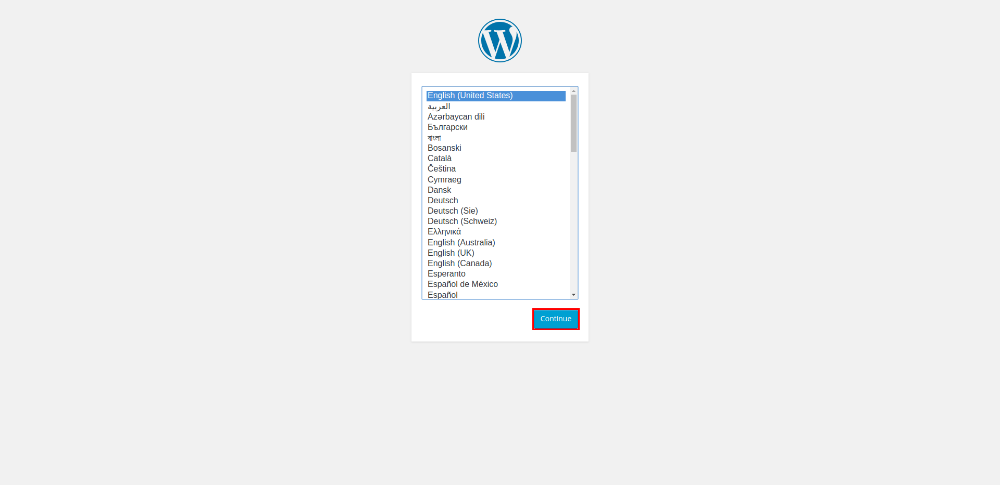
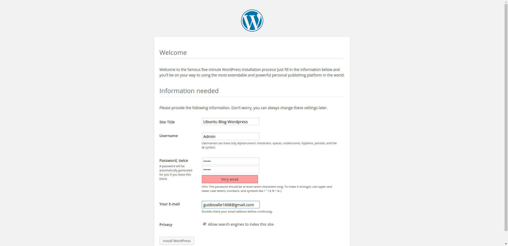
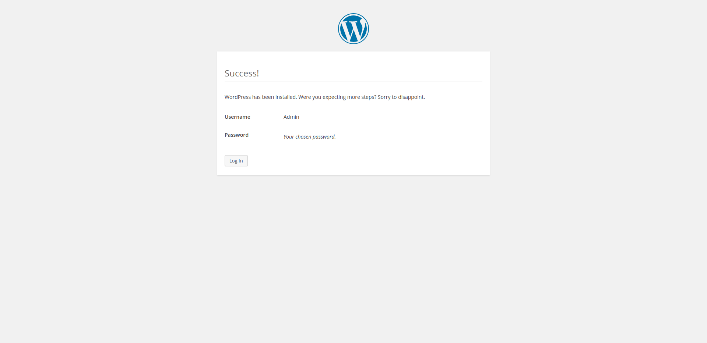

## How to install Wordpress


```python
from guide_automator_function import *

get("localhost:8080/")
highlight('#language-continue')
takeScreenshot()

```





## Select your language, and click on the continue button


```python
click('#language-continue')
fillIn('#weblog_title', 'Ubuntu Blog Wordpress')
fillIn('#user_login', 'Admin')
fillIn('#pass1', 'Admin')
fillIn('#pass2', 'Admin')
fillIn('#admin_email', 'guidovalle1608@gmail.com')
takeScreenshot()
```





## Fill in the fields


```python
click('.button')
takeScreenshot()
```





```python
## Congratulations, you have installed Wordpress!
```


```python

```
